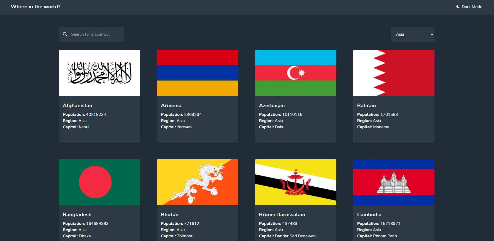

# Frontend Mentor - REST Countries API with color theme switcher solution

This is a solution to the [REST Countries API with color theme switcher challenge on Frontend Mentor](https://www.frontendmentor.io/challenges/rest-countries-api-with-color-theme-switcher-5cacc469fec04111f7b848ca). Frontend Mentor challenges help you improve your coding skills by building realistic projects. 

## Table of contents

- [Overview](#overview)
  - [The challenge](#the-challenge)
  - [Screenshot](#screenshot)
  - [Links](#links)
- [My process](#my-process)
  - [Built with](#built-with)
  - [What I learned](#what-i-learned)
  - [Continued development](#continued-development)
  - [Useful resources](#useful-resources)
- [Author](#author)
- [Acknowledgments](#acknowledgments)

**Note: Delete this note and update the table of contents based on what sections you keep.**

## Overview

### The challenge

Users should be able to:

- See all countries from the API on the homepage
- Search for a country using an `input` field
- Filter countries by region
- Click on a country to see more detailed information on a separate page
- Click through to the border countries on the detail page
- Toggle the color scheme between light and dark mode *(optional)*

### Screenshot



### Links

- Solution URL: [Github](https://github.com/Edgar-Avila/frontendmentor-countries-api)
- Live Site URL: [Website](https://countries-directory-chi.vercel.app/)

## My process

### Built with

- CSS custom properties
- Flexbox
- CSS Grid
- Mobile-first workflow
- [Tailwind](https://tailwindcss.com/) - Utility first CSS Framework
- [React](https://reactjs.org/) - JS library
- [Next.js](https://nextjs.org/) - React framework
- [Zustand](https://github.com/pmndrs/zustand) - Simple state management library

### What I learned

I learned to use SSG in NextJS. Before this project I had never used it in anything besides the examples in the documentation.

```js
export async function getStaticProps() {
  const res = await fetch("https://restcountries.com/v2/all")
  const data = await res.json()
  const countries = data.map(country => ({
    flag: country.flags.png,
    name: country.name,
    population: country.population,
    region: country.region,
    capital: country.capital || null,
    code: country.alpha3Code,
  }))
  return {
    props: { countries }
  }
}
```

I also learned just the basics of Zustand to do this project, such as the creation of a store and the use of the persist middleware.
```js
export const useThemeStorePersist = create(
    persist(
        (set, get) => ({
            isDark: false,
            toggleTheme: () => {
                set({ isDark: !get().isDark })
            }
        }),
        {
            name: 'theme',
        }
    )
)
```

I learned a bit about how SSG and SSR work, because of a problem I had with Zustand persist middleware, which uses localStorage to store the state. Localstorage can not be used in the server because it is a browser only API. So the first render in the server became a problem. I solved it with a custom hook with useEffect to make sure the localstorage is only used on mount.
```js
export const useThemeStore = (selector = state => state) => {
    const state = useThemeStorePersist()

    const [isDark, setIsDark] = useState(false)

    useEffect(() => {
        setIsDark(state.isDark)
    }, [state.isDark])

    return selector({
        toggleTheme: state.toggleTheme,
        isDark
    })
}
```


### Continued development

Since Zustand looks fun, I want to try learning a little more about it. Also I learned to love NextJS with this and a few other projects so I want to dive deeper into it. Tailwind also looks like a powerful tool so I am hoping to learn more about it too.

### Useful resources

- [Zustand Repo](https://github.com/pmndrs/zustand) - They very useful examples in the README section.
- [Stack Overflow Question](https://stackoverflow.com/questions/72649255/nextjs-zustand-persist-state) - This made the server rendering and client hydration finally click for me.

## Author

- Frontend Mentor - [@Edgar-Avila](https://www.frontendmentor.io/profile/Edgar-Avila)
- Github - [@Edgar-Avila](https://github.com/Edgar-Avila)